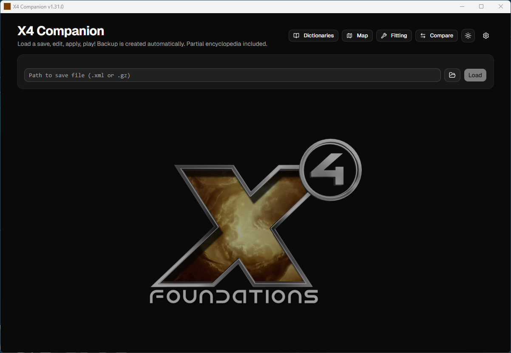

# X4 Companion

Companion app for **X4: Foundations**. A Windows desktop app built with Tauri 2 + React + Rust.  
Tested on v8 saves (vanilla + all DLCs), not tested on V9 yet.

> Unofficial tool, not affiliated with Egosoft. Use at your own risk.
>
> **Current release: v1.31.0** (development history starts here, earlier commits live in a private and very messy repo.)




---

## Overview

Five top-level views, accessible from the toolbar. No save file required for Dictionaries, Map, Fitting, and Ship Comparison:

| View | Description |
|------|-------------|
| **Editor** | Load a save file and browse/edit its contents across 12 tabs |
| **Dictionaries** | Browsable catalog of all in-game ships and equipment |
| **Map** | Full interactive universe map with faction control and overlays |
| **Fitting** | Design ship loadouts with live stat calculations |
| **Compare** | Side-by-side multi-ship comparison (max 4). Choose your reference ship using the radio button |

---

## Why this project?

Partly out of necessity. X4 existing tools cover some ground, but never quite the way I wanted. Partly out of curiosity and personal challenge: making sense of the save file XML structure, reverse-engineering the game's stat formulas, and figuring out how a long-time Delphi developer could build something modern and cross-platform without losing his mind in the process.

X4 also scratches a very specific itch. After ten years of EVE Online, I needed something almost as deep, but less demanding on online time. X4 delivers. And like any good EVE player, I eventually had to build a spreadsheet. This one just happens to have a UI.

**Standing on the shoulders of giants:** this project wouldn't have gotten off the ground without the following resources and open source work. Among the dozens I have read:

* [Mistralys/x4-savegame-parser](https://github.com/Mistralys/x4-savegame-parser): the first thing I dug into to understand the save file structure
* [TuxInvader/X4-Info-Miner](https://github.com/TuxInvader/X4-Info-Miner): invaluable for understanding what data was actually worth extracting
* [BeamerMiasma/X4-Foundations](https://github.com/BeamerMiasma/X4-Foundations): savegame analysis and visualization, another great reference
* [X Community Wiki](https://wiki.egosoft.com/Main/): the authoritative reference for game mechanics
* [enenra/x4modding - Universe Creation](https://github.com/enenra/x4modding/wiki/Universe-Creation): essential for making sense of the galaxy map XML
* [Quantum Anomaly](https://www.qsna.eu/): inspiration for the fitting tool approach (and old EVE memories)
* [Roguey's X4 site](https://roguey.co.uk/x4/): a goldmine of ship and equipment data

---

## Save Editor

Open any `.xml` or `.xml.gz` save file and browse 12 tabs:

| Tab | Access | Description |
|-----|--------|-------------|
| **Overview** | R/W | Player name, money |
| **Map** | R | Save-centric player map: Only visited sectors, true faction ownership, gates, NPC stations, ship-presence highlight |
| **Inventory** | R/W | All wares with editable quantities, grouped by categories |
| **Blueprints** | R/W | Full blueprint list (12 categories): Filter Owned / Missing / All, select/deselect all per category |
| **Reputations** | R/W | All 33 factions: colored rank badges, slider editor (capped at ceremony thresholds), licences display |
| **Fleet** | R/W | All player ships: hierarchical fleet formations, nested sub-fleets, expandable loadout (shields, weapons, turrets, engines, equipped mods in orange), editable ship names, cross-navigation to Employees/Stations |
| **Employees** | R/W | All NPCs: 5 skills, star rating (0–15), editable per-trait (quick actions `All 5` / `All 0`), linked ship or station |
| **Stations** | R/W | Player stations: modules, manager, cargo with editable amounts |
| **Deployables** | R | Active drones, satellites, and beacons by sector |
| **Stats** | R | In-game player statistics |
| **Messages** | R | Player inbox |
| **Inject** | R/W | Inject ship templates or saved custom fittings directly into the save |

### Ship Injection

- **S / M / L / XL templates:** ~300 pre-extracted ship templates organized by size class, with preview images
- **Custom fitting injection:** inject any fitting saved from the Fitting tool
- **Smart placement:** injected ships appear around the player's current position, collision-free (3-layer radial algorithm)
- **Correct zone targeting:** uses `lastcontrolled` to find the actual piloted ship
- **Clean crew:** named NPC pilot removed from cockpit, anonymous crew preserved and promotable in-game
- **Batch injection:** queue multiple ships, inject in one click

---

## Dictionaries

Browsable reference for (almost) all in-game equipment and ships, generated from the game's own XML files:

| Tab | Content |
|-----|---------|
| **Ships** | All ships: size, type, faction, hull, cargo, slots breakdown, physics, price |
| **Weapons** | Fixed weapons: DPS, range, damage, reload |
| **Turrets** | Turret weapons: same stats |
| **Engines** | Engines: forward/reverse/travel thrust, boost |
| **Shields** | Shield generators: capacity, recharge rate and delay |
| **Thrusters** | Thrusters: strafe, pitch, yaw, roll thrust |
| **Equipment Mods** | All equipment mods: category, quality tier, stat multipliers |

---

## Interactive Map

Full X4 universe map accessible from the toolbar (no save required):

- **Faction coloring:** hexagons colored by controlling faction
- **DLC filters:** toggle Base / Terran / Split / Pirate / Boron / Timelines / Packs
- **Zoom & pan:** smooth navigation
- **Sector labels:** scale-aware, rendered in SVG
- **Gates:** positions from game XML, visual connections between gate pairs (no highways for now)
- **NPC stations:** 204 fixed stations (shipyards, wharfs, equipment docks, trade stations, defense stations, pirate bases), filterable by type and DLC
- **Tooltips:** cluster and sector info (resources, description, faction logo); station type on hover
- **Light/dark theme**

The **Map tab inside the Editor** is a separate save-centric view: only visited sectors are revealed, with fog on unexplored space and a player ship highlight.

---

## Fitting Tool

Design and simulate ship loadouts with live stat calculations:

- **4-column layout:** ship selector, individual slot assignment, compatible equipment picker, live stats always visible
- **Ship filters:** by size class (S / M / L / XL), faction, type all with preview image
- **Slot groups:** Weapons / Turrets / Hull Shields / Section Shields / Engines / Thruster, with count by size
- **Live stats:** total shields, max speed, travel speed, boost speed, maneuverability, DPS, docking capacity, hangar storage (calculation formulas still WIP)
- **Module substitution:** swap any slot and see the diff vs baseline in green/red
- **Save / load fittings:** named custom fittings stored in `AppData/Roaming/X4 Companion/custom_fittings/`
- **Inject into save:** send a saved fitting directly to the Inject tab

---

## Ship Comparator

Side-by-side comparison of multiple ships across all catalog stats (hull, cargo, speed, slots, physics).

---

## Installation (if you don’t want to build)

Download the latest installer from the Releases page:

- `X4Companion_1.31.0_x64-setup.exe` — NSIS installer (recommended)
- `X4Companion_1.31.0_x64_en-US.msi` — MSI package

No dependencies required. Windows 10/11 with WebView2 (included by default since Windows 11).

---

## Usage

### Save Editor

1. Launch **X4 Companion**
2. Click the gear icon to set your X4 saves folder
3. Click **Open save file** and select a save (`.xml` or `.xml.gz`)
4. Click the **Load** button and wait for your save to be read
5. Browse the tabs and edit what you need
6. Click **Apply changes** once you are satisfied (no need to apply between tab changes). A `.bak` backup file is created automatically before writing.


> **NOTE:** Only one `.bak` file will be created, containing the original save file. Any further changes on the same save will be written directly to the already modified save, preserving the original.

> **Do not edit a save while X4 is running.**  
> Well you can… you’ll have to reload the save anyway :D

### Ship Injection

1. Open a save file
2. Go to the **Inject** tab
3. Select ships from the S / M / L / XL dropdowns, or pick a saved custom fitting
4. Click **Inject (N):** ships appear around the player's position in-game **with no AI pilot**, you’ll need to promote one of the crew members or teleport to the ship

### Dictionaries, Map, Fitting, Compare

Available from the main toolbar without opening a save file.

---

## Performance (on my rig)

| Operation | Time (520 MB uncompressed save) |
|---|---|
| Open `.xml` or `.gz` | ~2-3 seconds |
| Apply + write `.gz` | ~5–10 seconds |

Streaming parser, no full DOM load at any point. The write bottleneck is gzip recompression.

---

## Build from source

**Requirements:** [Node.js](https://nodejs.org) 18+, [Rust](https://rustup.rs) stable, [Tauri CLI v2](https://tauri.app)

```bash
git clone https://github.com/dirlligafu/X4Companion.git
cd X4Companion
npm install

# Dev (hot-reload)
npm run tauri dev

# Production build
npm run tauri build
```

**Stack:** Tauri 2 · React 18 · TypeScript · Rust · shadcn/ui · Tailwind CSS v4 · Lucide icons

---

## License

Distributed without warranty of any kind. X4: Foundations is a trademark of Egosoft.
